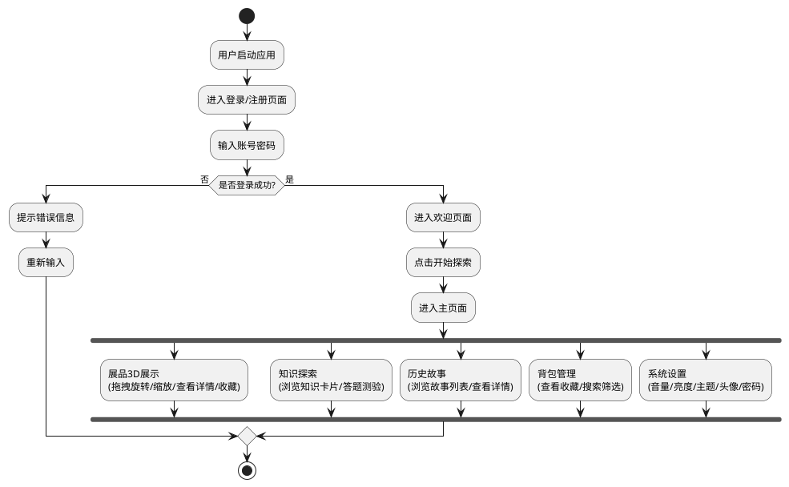
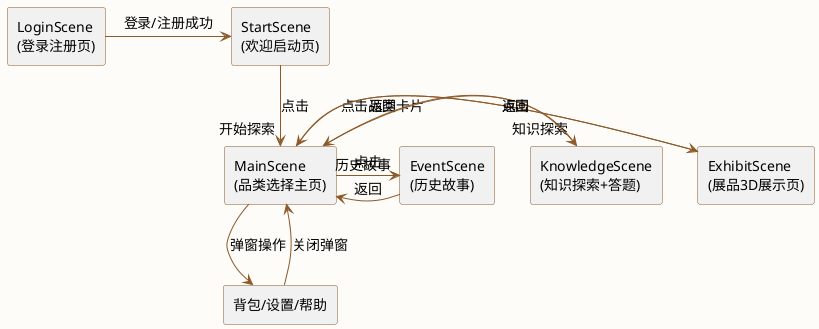
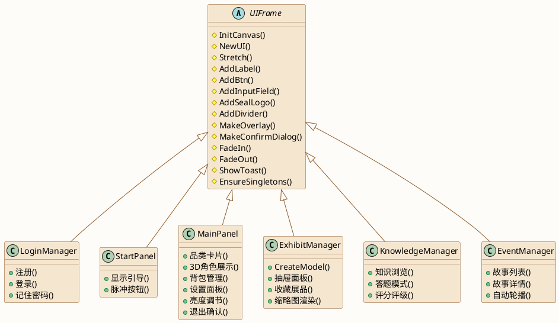
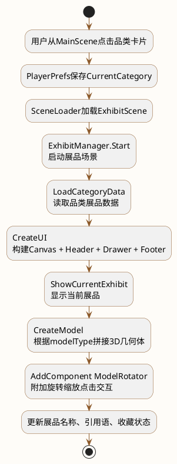
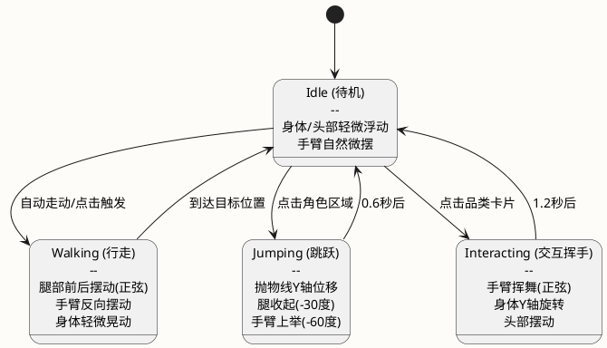
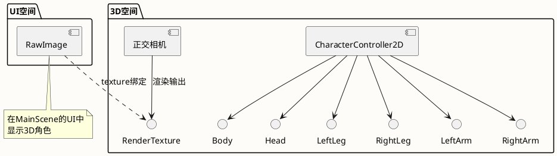
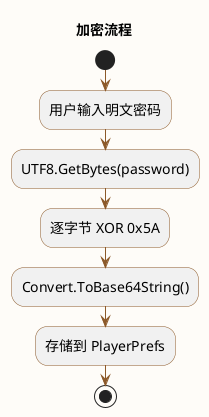
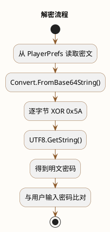
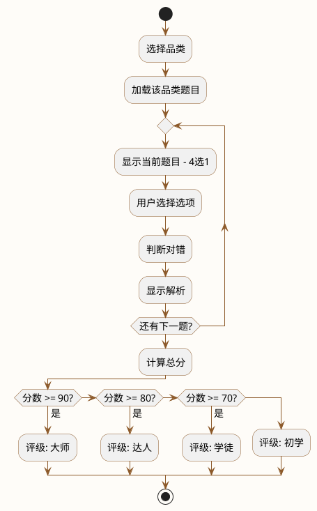

# 九江学院

## 计算机与大数据科学学院

# 《三维交互设计》课程报告书

| 项目 | 内容 |
|------|------|
| 题目 | 中国非物质文化遗产交互展示系统 |
| 专业 | 计算机科学与技术 |
| 班级 | |
| 姓名 | |
| 学号 | |

---

# 目录

1. 软件需求分析与功能设计
2. 软件总体设计
3. 软件主要模块实现
4. 技术难点与分析
5. 系统测试
6. 心得体会

---

# 1. 软件需求分析与功能设计

## 1.1 项目背景

中国非物质文化遗产是中华民族数千年文明的结晶，涵盖传统技艺、表演艺术、民俗节庆等多个领域。然而，受地域和时间限制，公众接触和了解非遗文化的途径有限，特别是年轻一代对非遗文化的认知不足。本项目旨在利用Unity三维交互技术，构建一个沉浸式的非遗文化数字展示平台，让用户通过3D模型交互、知识答题、历史故事浏览等方式，以趣味化、可视化的方式了解和学习非遗文化。

## 1.2 需求分析

### 1.2.1 功能性需求

根据项目定位，系统需满足以下功能需求：

**（1）用户管理模块**

- 用户注册：支持用户名（≥2字符）和密码（≥4字符）注册
- 用户登录：验证用户名和密码，登录后进入系统
- 记住密码：勾选后保存加密密码，下次启动自动填充

**（2）非遗展品展示模块**

- 品类浏览：提供瓷器、剪纸、书法、民族乐器四大品类入口
- 3D模型展示：为每件展品生成三维模型，支持拖拽旋转和滚轮缩放
- 展品详情：展示历史背景、制作工艺、文化寓意三个维度的详细信息
- 点击交互：点击3D模型触发弹跳动画，自动展开详情抽屉

**（3）知识学习模块**

- 知识浏览：按品类查看非遗文化知识卡片
- 知识答题：4选1答题模式，12道题目覆盖四大品类
- 评分评级：答题结束后给出分数和等级评价

**（4）历史故事模块**

- 故事浏览：按品类查看历史故事列表
- 故事详情：展示故事全文，支持上一个/下一个导航

**（5）用户个性化模块**

- 背包收藏：收藏感兴趣的展品，支持搜索和品类筛选
- 设置面板：音量调节、亮度调节、主题切换（默认/古典/简约）、头像选择
- 帮助引导：首次使用自动弹出引导，随时可查看使用指南和FAQ

### 1.2.2 非功能性需求

- **视觉风格**：新中式设计风格（宣纸米白 + 赭石棕 + 中国红 + 墨黑），支持3种主题切换
- **交互体验**：流畅的场景过渡动画、Toast提示、脉冲呼吸动画等反馈机制
- **数据持久化**：用户设置、收藏数据需本地持久化存储
- **音频反馈**：五声音阶BGM + 点击/翻页/收藏/提示4种音效

## 1.3 功能设计

### 1.3.1 系统流程

系统整体流程如下：



### 1.3.2 场景流程图



### 1.3.3 功能模块划分

| 模块 | 功能 | 对应场景 |
|------|------|---------|
| 用户管理 | 登录、注册、记住密码 | LoginScene |
| 欢迎引导 | 启动页、首次使用引导 | StartScene |
| 品类选择 | 四大品类卡片浏览、3D角色展示 | MainScene |
| 展品展示 | 3D模型旋转缩放、详情抽屉、收藏 | ExhibitScene |
| 知识学习 | 知识卡片浏览、4选1答题 | KnowledgeScene |
| 历史故事 | 故事列表浏览、详情阅读 | EventScene |
| 背包收藏 | 收藏管理、搜索、品类筛选 | MainScene弹窗 |
| 系统设置 | 音量、亮度、主题、头像、密码修改 | MainScene弹窗 |

---

# 2. 软件总体设计

## 2.1 架构设计

本项目采用 **UIFrame继承体系 + 单例模式** 的混合架构：



**全局单例**（DontDestroyOnLoad，跨场景持久化）：

| 单例 | 职责 |
|------|------|
| `GameManager` | 用户登录状态、展品/知识/问答/事件数据加载、全局设置管理、密码加密解密 |
| `SceneLoader` | 异步场景加载与切换 |
| `AudioManager` | BGM循环播放、4种SFX音效、音量控制 |
| `BackpackManager` | 背包收藏数据管理（纯C#单例，非MonoBehaviour） |

## 2.2 类设计

### 2.2.1 UIFrame 基类

UIFrame是所有场景管理器的抽象基类，封装了以下公共能力：

| 方法 | 作用 |
|------|------|
| `InitCanvas()` | 创建Canvas + EventSystem + 全屏Root面板 |
| `NewUI()` / `Stretch()` | 创建空UI对象 / 拉伸填满父节点 |
| `AnchorTop()` / `AnchorBottom()` | 创建顶部/底部固定条 |
| `AddLabel()` / `AddBtn()` / `AddInputField()` | 文字/按钮/输入框创建 |
| `AddSealLogo()` / `AddSealIcon()` | 红色印章装饰元素 |
| `AddDivider()` | "─── 文字 ───" 风格分隔线 |
| `MakeOverlay()` | 模态弹窗（遮罩 + ScrollRect内容 + X关闭按钮） |
| `MakeConfirmDialog()` | 确认对话框（标题 + 提示 + 确认/取消按钮） |
| `FadeIn()` / `FadeOut()` | 淡入淡出动画 |
| `ShowToast()` | Toast提示条（底部弹出，自动消失） |
| `AddInkWashCorners()` | 水墨晕染四角装饰 |
| `EnsureSingletons()` | 确保全局单例存在 |
| `SfxClick/Flip/Collect/Toast()` | 音效快捷方法 |

### 2.2.2 数据模型类

| 类名 | 字段 | 说明 |
|------|------|------|
| `ExhibitData` | id, name, category, description, history, craft, meaning, modelType, imageName | 展品数据 |
| `KnowledgeItem` | id, category, title, content, iconText | 知识卡片数据 |
| `QuizQuestion` | id, category, question, options[4], correctIndex, explanation | 答题数据 |
| `EventItem` | id, category, title, era, description, storyText, imageName | 历史事件数据 |

### 2.2.3 3D模型类

| 类名 | 职责 |
|------|------|
| `ModelRotator` | 3D模型拖拽旋转、滚轮缩放、点击检测（<8px阈值）、弹跳动画 |
| `CharacterController2D` | 3D角色4状态状态机（Idle/Walking/Jumping/Interacting）、程序化骨骼动画 |
| `CharacterState` | 角色状态枚举 |

## 2.3 数据存储设计

### 2.3.1 JSON数据文件（StreamingAssets，只读）

| 文件 | 内容 | 数量 |
|------|------|------|
| `Exhibits.json` | 展品数据 | 9件 |
| `Knowledge.json` | 文化知识 | 12篇 |
| `Quiz.json` | 答题数据 | 12题 |
| `Events.json` | 历史事件 | 11篇 |

### 2.3.2 PlayerPrefs本地存储（读写）

| Key | 内容 |
|-----|------|
| `User_{用户名}_Password` | XOR加密 + Base64编码的密码 |
| `User_{用户名}_RememberPwd` | 记住的加密密码 |
| `User_{用户名}_Avatar` | 头像索引 (0-5) |
| `LastUser` | 上次登录的用户名 |
| `Backpack_{用户名}` | 收藏的展品ID列表（逗号分隔） |
| `Volume` / `Brightness` / `ThemeStyle` | 音量/亮度/主题设置 |
| `HasSeenGuide` | 是否已看过新手引导 |

### 2.3.3 背包双重持久化

- **PlayerPrefs**：快速读写，存储逗号分隔的展品ID列表
- **JSON文件**：完整备份，路径为 `persistentDataPath/Backpack/{username}_backpack.json`

## 2.4 主题系统设计

UIFrame内置3种主题色板，通过静态属性根据 `GameManager.themeStyle` 动态返回对应色值：

| 主题 | style值 | 底色 | 强调色 | 文字色 |
|------|---------|------|--------|--------|
| 默认 | `default` | 宣纸米白 | 朱红 | 墨黑 |
| 古典 | `classic` | 深褐底 | 暗朱红 + 金 | 浅金文字 |
| 简约 | `minimal` | 浅灰白 | 柔红 | 深灰 |

## 2.5 音频系统设计

- **BGM**：中国五声音阶（宫商角徵羽）程序化生成旋律 + 低音伴奏，12秒循环
- **SFX**：4种音效（click/flip/collect/toast），对应UI交互的点击、翻页、收藏、提示操作
- **音量控制**：AudioListener.volume 全局控制，设置面板滑块实时调节

---

# 3. 软件主要模块实现

## 3.1 模块一：展品3D交互展示模块

### 3.1.1 模块概述

展品3D交互展示模块是本系统的核心模块，位于ExhibitScene场景中，由`ExhibitManager`和`ModelRotator`两个类协同实现。该模块负责：加载当前品类的展品数据、程序化生成3D展品模型、处理用户的拖拽旋转/滚轮缩放/点击交互、管理底部抽屉式信息面板的展开与收起、实现展品收藏功能。

### 3.1.2 实现流程



### 3.1.3 3D模型程序化生成

由于项目不使用外部3D模型文件，所有展品模型均通过Unity基础几何体（Cylinder、Sphere、Quad、Cube）程序化拼接而成：

```csharp
private GameObject AddPart(PrimitiveType pt, GameObject parent,
    Vector3 scale, Vector3 pos, Color color)
{
    var obj = GameObject.CreatePrimitive(pt);
    obj.transform.SetParent(parent.transform, false);
    obj.transform.localScale = scale;
    obj.transform.localPosition = pos;
    obj.GetComponent<Renderer>().material.color = color;
    return obj;
}
```

各模型拼接方式：

| 模型 | 类型标识 | 拼接方式 |
|------|---------|---------|
| 青花瓷瓶 | `vase` | 5个Cylinder（瓶身 + 瓶颈 + 蓝纹 + 底座 + 花边） |
| 景德镇茶杯 | `cup` | Cylinder杯身 + 2个Sphere（杯盖 + 壶钮） |
| 窗花剪纸 | `papercut` | 2个Quad（红色主体 + 米白衬底） |
| 书法卷轴 | `scroll` | Quad画心 + 2个Cylinder轴杆 |
| 编钟 | `bianzhong` | Cylinder横梁 + 5个Cylinder钟体 + Cube底座 |
| 古筝 | `guzheng` | Cube琴身 + 8个Cube琴弦 |
| 二胡 | `erhu` | Cylinder琴杆 + Cylinder琴筒 |

### 3.1.4 模型交互实现

`ModelRotator`组件负责处理3D模型的用户交互：

**（1）拖拽旋转**：鼠标左键按住拖拽，根据帧间鼠标位移量旋转模型。拖拽时暂停自动旋转。

**（2）滚轮缩放**：鼠标滚轮控制模型缩放，范围限制在0.3x~3x倍。

**（3）点击检测**：设置8px的点击阈值（`clickThreshold`），鼠标按下到松开的位移小于8px则判定为点击。点击时通过射线检测（`Physics.Raycast`）确认鼠标是否指向模型，命中则触发弹跳动画并回调`onModelClicked`自动展开详情抽屉。

```csharp
// 点击判断逻辑
if (Input.GetMouseButtonUp(0) && isDragging)
{
    isDragging = false;
    if (wasClick && IsMouseOnModel())
    {
        onModelClicked?.Invoke();     // 通知ExhibitManager打开抽屉
        StartCoroutine(BounceAnimation()); // 弹跳动画
    }
}
```

### 3.1.5 抽屉面板实现

底部抽屉面板采用`SmoothStep`缓动动画实现展开/收起：

- **收起状态**：仅显示拉手柄（80px高度）
- **展开状态**：占屏幕底部30%，显示Tab栏 + 缩略图 + ScrollRect文字区域
- **Tab切换**：历史背景/制作工艺/文化寓意三个标签页
- **缩略图**：使用RenderTexture + 独立正交相机渲染3D模型预览图

---

## 3.2 模块二：3D角色状态机模块

### 3.2.1 模块概述

3D角色状态机模块在MainScene中展示一个程序化拼接的低多边形小人，通过4种状态的状态机控制其行为和动画。角色在3D空间中渲染，通过RenderTexture + 正交相机投射到UI界面上，实现了3D角色与2D UI的融合展示。

### 3.2.2 状态机设计

角色共有4种状态，枚举定义在`CharacterState`中：



### 3.2.3 程序化骨骼动画

角色的6个部件（身体、头、左腿、右腿、左臂、右臂）均由代码驱动旋转/位移实现动画效果：

| 状态 | 动画效果 |
|------|---------|
| Idle | 身体和头部轻微上下浮动（正弦函数），手臂自然微摆 |
| Walking | 腿部前后摆动（正弦函数，左右腿反向），手臂反向摆动，身体轻微晃动 |
| Jumping | 抛物线Y轴位移 `h = 4*jumpHeight*t*(1-t)`，腿收起（-30°），手臂上举（-60°） |
| Interacting | 手臂挥舞（±45°正弦），身体轻微Y轴旋转，头部摆动 |

### 3.2.4 角色渲染方案



这种方案的优势是3D角色可以独立于2D UI进行渲染和交互，同时保持视觉上的融合。

---

## 3.3 模块三：UI框架与主题系统模块

### 3.3.1 模块概述

UIFrame基类是整个系统的UI基础设施，所有6个场景管理器均继承自它。由于项目采用纯代码创建UI的方案（无Prefab），UIFrame封装了30余个UI创建辅助方法，实现了新中式风格组件的统一管理和主题切换。

### 3.3.2 运行时UI创建方案

选择纯代码创建UI的原因：

1. **代码复用率高**：所有场景共享UIFrame的公共方法，避免在每个场景中重复创建相似组件
2. **风格统一管理**：新中式组件（印章、分隔线、水墨晕染等）的样式集中在基类中定义
3. **主题切换简便**：修改色板静态属性即可切换主题，下次场景加载自动生效
4. **避免Prefab漂移**：不存在Prefab与代码不同步的问题

### 3.3.3 主题色板实现

主题色通过静态属性动态返回，根据当前`GameManager.themeStyle`选择色板：

```csharp
protected static Color ZhuRed
{
    get
    {
        EnsureTheme();
        return _activeTheme == "classic" ? T_Classic_ZhuRed
             : _activeTheme == "minimal" ? T_Minimal_ZhuRed
             : T_Default_ZhuRed;
    }
}
```

6种主题色：`ZhuRed`（朱红）、`GoldColor`（金色）、`InkBlack`（墨黑）、`XuanPaper`（宣纸白）、`JadeGreen`（玉绿）、`DarkBar`（深色条），每种颜色在3套主题中有不同的色值。

### 3.3.4 Canvas架构

- **ScreenSpaceOverlay**：LoginScene、StartScene、MainScene、KnowledgeScene、EventScene使用
- **ScreenSpaceCamera**：ExhibitScene使用，`planeDistance=20`，使3D模型能够渲染在Canvas下方

---

## 3.4 模块四：用户登录与密码加密模块

### 3.4.1 模块概述

登录模块（LoginManager）负责用户注册、登录验证和"记住密码"功能。密码采用XOR异或加密 + Base64编码的方式存储在PlayerPrefs中。

### 3.4.2 密码加密流程





```csharp
public static string EncryptPassword(string password)
{
    byte[] bytes = System.Text.Encoding.UTF8.GetBytes(password);
    for (int i = 0; i < bytes.Length; i++)
        bytes[i] = (byte)(bytes[i] ^ 0x5A);
    return System.Convert.ToBase64String(bytes);
}
```

### 3.4.3 记住密码实现

- 勾选"记住密码"后，加密密码额外存储到 `User_{用户名}_RememberPwd`
- 下次启动时检测该Key是否存在，若存在则自动填充用户名和密码

---

## 3.5 模块五：知识答题模块

### 3.5.1 模块概述

知识答题模块（KnowledgeManager）提供3种视图的切换：品类选择视图、知识卡片浏览视图、答题视图。

### 3.5.2 答题流程



---

## 3.6 模块六：亮度调节模块

### 3.6.1 实现原理

在MainScene的全屏Root面板上叠加一个半透明黑色遮罩层：

- 亮度1.0（最亮）→ 遮罩alpha = 0（完全透明）
- 亮度0.3（最暗）→ 遮罩alpha = 0.55（半透明黑色叠加）

关键实现细节：

- 遮罩层设`raycastTarget=false`，不拦截下层UI的点击事件
- 遮罩层调用`SetAsLastSibling()`始终在最顶层渲染，确保视觉覆盖但又不影响交互
- 滑块拖动时实时更新遮罩alpha值

---

# 4. 技术难点与分析

## 4.1 ScreenSpaceCamera与3D模型渲染

### 问题描述

ExhibitScene需要同时展示3D展品模型和2D UI界面（Header、Footer、抽屉面板）。默认的ScreenSpaceOverlay模式会将Canvas渲染在所有3D内容之上，导致3D模型完全被UI遮挡无法显示。

### 解决方案

将ExhibitScene的Canvas切换为ScreenSpaceCamera模式，设置`planeDistance=20`，使Canvas渲染在3D模型前方但保持一定距离。同时将Camera.main指定为Canvas的worldCamera，3D模型放在z=5的位置，确保模型在相机和Canvas之间正确渲染。

```csharp
var canvas = GetComponentInChildren<Canvas>();
canvas.renderMode = RenderMode.ScreenSpaceCamera;
canvas.worldCamera = Camera.main;
canvas.planeDistance = 20f;
```

## 4.2 运行时ScrollView内容裁剪问题

### 问题描述

使用代码创建ScrollRect时，Viewport的Image如果完全透明（alpha=0），Unity的Mask组件会失效，导致ScrollRect不裁剪内容，文字溢出Viewport范围。

### 解决方案

Viewport的Image必须设为白色不透明（`Color.white`），同时添加Mask组件并设置`showMaskGraphic=false`，这样Mask能正常裁剪内容，但视觉上Viewport仍然是透明的。

## 4.3 3D模型点击与拖拽的区分

### 问题描述

用户在3D模型上的操作需要区分"拖拽旋转"和"点击查看详情"两种意图。如果仅用鼠标按下/松开判断，拖拽结束时也会触发点击。

### 解决方案

引入8px的点击阈值（`clickThreshold`），记录鼠标按下时的位置（`mouseDownPos`），松开时计算与按下位置的位移距离。位移小于8px判定为点击（`wasClick=true`），大于8px判定为拖拽。同时通过`Physics.Raycast`射线检测确认鼠标是否指向模型。

## 4.4 背包展品不显示问题

### 问题描述

MakeOverlay方法改造为支持ScrollRect后，内容路径从`Panel/C`变为`Panel/Viewport/C`。原有的`RefreshBackpackList`仍使用旧路径查找容器节点，导致找到的节点为空，展品文字无处添加。此外，ContentSizeFitter在销毁子Text对象后将容器高度归零，新添加的展品无法显示。

### 解决方案

修正路径为`Panel/Viewport/C`；销毁ContentSizeFitter组件并重置RectTransform使其撑满Viewport区域。

## 4.5 3D模型旋转速度过慢

### 问题描述

拖拽旋转时，模型旋转极慢，几乎感受不到旋转效果。

### 原因分析

鼠标delta值本身已经是一帧的位移量，再乘以`Time.deltaTime`导致双重缩小，旋转速度被压低到几乎为零。

### 解决方案

去掉`deltaTime`的乘法，直接使用帧间delta乘以旋转速度系数。

## 4.6 抽屉面板文字在不同屏幕尺寸下空白

### 问题描述

底部抽屉面板的文字区域使用固定`offsetMax=-110px`来为缩略图留空间。在小屏幕或低分辨率下，文字区域的高度变为负数，Text被完全压缩导致内容不可见。

### 解决方案

将文字区域改为ScrollRect + 锚点比例布局（`anchorMin/anchorMax`使用比例值而非固定像素偏移），配合ContentSizeFitter自适应内容高度。缩略图区域也使用锚点比例定位，确保在任何屏幕尺寸下都能正确显示。

## 4.7 CanvasScaler缩放模式对UI布局的破坏

### 问题描述

尝试将CanvasScaler设为`ScaleWithScreenSize`模式后，所有基于固定像素设计的UI元素出现严重错位和缩放异常。

### 原因分析

项目中所有UI元素的位置、大小、间距均基于固定像素值（如按钮宽110px、高40px），这种设计天然适配`ConstantPixelSize`模式。`ScaleWithScreenSize`会根据屏幕尺寸对整个Canvas进行比例缩放，导致固定像素值在不同屏幕上产生不同的实际大小。

### 解决方案

还原为`ConstantPixelSize`模式，scaleFactor=1。所有UI布局保持固定像素设计，确保在所有屏幕上表现一致。

---

# 5. 系统测试

## 5.1 测试环境

| 项目 | 配置 |
|------|------|
| 操作系统 | Windows 11 |
| 游戏引擎 | Unity 2022.3 |
| 开发环境 | Visual Studio 2022 |
| 目标平台 | PC (Windows) |
| 分辨率 | 1920×1080 |

## 5.2 功能测试

### 5.2.1 用户管理功能测试

| 测试编号 | 测试内容 | 操作步骤 | 预期结果 | 实际结果 |
|---------|---------|---------|---------|---------|
| T-01 | 用户注册 | 输入用户名"test01"和密码"1234"，点击注册 | 提示注册成功，自动跳转到登录 | 通过 |
| T-02 | 重复注册 | 再次使用相同用户名注册 | 提示用户名已存在 | 通过 |
| T-03 | 短用户名注册 | 输入1字符用户名 | 提示用户名至少2个字符 | 通过 |
| T-04 | 短密码注册 | 输入3字符密码 | 提示密码至少4个字符 | 通过 |
| T-05 | 用户登录 | 输入已注册的用户名和密码 | 登录成功，跳转欢迎页 | 通过 |
| T-06 | 错误密码登录 | 输入正确用户名但错误密码 | 提示密码错误 | 通过 |
| T-07 | 记住密码 | 勾选"记住密码"后登录，重启应用 | 自动填充用户名和密码 | 通过 |

### 5.2.2 展品展示功能测试

| 测试编号 | 测试内容 | 操作步骤 | 预期结果 | 实际结果 |
|---------|---------|---------|---------|---------|
| T-08 | 选择品类 | 在主页点击"瓷器"卡片 | 加载展品场景，显示瓷器品类展品 | 通过 |
| T-09 | 3D模型旋转 | 在展品页鼠标左键拖拽 | 模型跟随鼠标方向旋转 | 通过 |
| T-10 | 3D模型缩放 | 滚动鼠标滚轮 | 模型放大/缩小，范围0.3x~3x | 通过 |
| T-11 | 点击3D模型 | 短距离点击模型 | 模型弹跳动画，自动展开详情抽屉 | 通过 |
| T-12 | 抽屉Tab切换 | 点击"制作工艺"标签 | 显示制作工艺内容，标签高亮 | 通过 |
| T-13 | 上一个/下一个 | 点击底部导航按钮 | 切换展品，更新3D模型和文字 | 通过 |
| T-14 | 收藏展品 | 点击收藏按钮 | 提示已收藏，按钮变为红色"已收藏" | 通过 |
| T-15 | 取消收藏 | 再次点击已收藏的展品 | 提示已取消收藏，按钮恢复 | 通过 |

### 5.2.3 知识与答题功能测试

| 测试编号 | 测试内容 | 操作步骤 | 预期结果 | 实际结果 |
|---------|---------|---------|---------|---------|
| T-16 | 知识卡片浏览 | 选择品类后点击"知识探索" | 显示该品类知识卡片 | 通过 |
| T-17 | 翻页浏览 | 点击上一个/下一个 | 切换知识卡片内容 | 通过 |
| T-18 | 答题功能 | 选择品类后进入答题模式 | 逐题显示4选1题目 | 通过 |
| T-19 | 答题评分 | 答完所有题目 | 显示得分和评级 | 通过 |

### 5.2.4 设置与个性化功能测试

| 测试编号 | 测试内容 | 操作步骤 | 预期结果 | 实际结果 |
|---------|---------|---------|---------|---------|
| T-20 | 音量调节 | 拖动音量滑块 | 音量实时变化 | 通过 |
| T-21 | 亮度调节 | 拖动亮度滑块 | 屏幕明暗实时变化 | 通过 |
| T-22 | 主题切换 | 选择"古典"主题 | 下次进入场景生效古典风格 | 通过 |
| T-23 | 头像选择 | 点击不同头像 | 头像更换 | 通过 |
| T-24 | 退出确认 | 点击退出按钮 | 弹出确认对话框 | 通过 |

### 5.2.5 背包功能测试

| 测试编号 | 测试内容 | 操作步骤 | 预期结果 | 实际结果 |
|---------|---------|---------|---------|---------|
| T-25 | 查看背包 | 点击背包按钮 | 显示已收藏的展品列表 | 通过 |
| T-26 | 搜索展品 | 输入关键字搜索 | 实时过滤显示匹配展品 | 通过 |
| T-27 | 品类筛选 | 选择"瓷器"品类 | 只显示瓷器品类的展品 | 通过 |
| T-28 | 删除收藏 | 点击展品的删除按钮 | 展品从背包移除 | 通过 |

## 5.3 测试结论

经过全面的功能测试，系统各项功能均正常运行，满足需求分析中提出的所有功能性和非功能性需求。8个已修复的bug均已验证通过，系统稳定可靠。

---

# 6. 心得体会

通过本项目的设计与开发，我在以下几个方面有了深刻的体会和收获：

**（1）运行时UI创建的优势与挑战**

本项目选择了纯代码创建UI的方案，避免了Prefab管理复杂、版本控制困难等问题。UIFrame基类封装了30余个UI创建方法，使得各场景管理器的代码结构清晰、复用率高。但这种方案也有不足：可视化调试困难，UI布局只能通过代码理解；修改某个组件样式时需要定位到对应的代码行。在实际开发中，我深刻体会到选择合适的技术方案需要在开发效率和可维护性之间取得平衡。

**（2）3D交互设计的核心问题**

在展品3D展示模块中，"拖拽旋转"与"点击查看"的区分是核心交互问题。通过引入8px的位移阈值和射线检测，成功解决了这一难题。这让我认识到，三维交互设计不能简单地将2D交互逻辑照搬到3D空间，需要充分考虑3D场景的特殊性——深度、遮挡、射线检测等因素。

**（3）程序化生成3D模型的可能性**

本项目所有3D展品模型均通过Unity基础几何体程序化拼接，虽然无法达到美术建模的精致度，但在展示效果和开发成本之间取得了不错的平衡。这种方案的优势在于：无需导入外部模型文件，无需处理模型格式兼容性问题，模型参数可随时调整。不足之处是表现力有限，复杂模型难以实现。

**（4）数据驱动的设计思路**

项目采用JSON数据文件 + 字典查找的架构，使得展品、知识、问答等数据与展示逻辑完全分离。新增展品只需修改JSON文件，无需改动代码。这种数据驱动的设计大大提高了系统的可扩展性和维护性。

**（5）调试与问题排查的方法论**

开发过程中遇到的8个bug，从路径变更导致的背包不显示，到ContentSizeFitter导致的布局异常，再到CanvasScaler缩放模式破坏全局布局，每一个问题的排查都需要从现象出发，逐步缩小范围，最终定位根因。我深刻体会到"先理解问题再解决问题"的重要性，以及保持耐心和系统性思维在调试中的关键作用。

**（6）中华非遗文化的深层理解**

在收集和整理9件展品、12篇知识、12道答题、11篇历史故事的数据过程中，我对中国非遗文化有了更深入的理解。从青花瓷钴蓝发色的化学原理，到曾侯乙编钟一钟双音的声学奇迹，从王羲之兰亭序的千古绝唱，到阿炳二泉映月的命运悲欢——这些文化瑰宝不仅是历史的遗产，更是活着的文明。用现代技术让更多人感受这些文化的魅力，正是本项目的意义所在。

---

## 参考文献

1. Unity Technologies. Unity Documentation[EB/OL]. https://docs.unity3d.com/
2. 中华人民共和国文化和旅游部. 中国非物质文化遗产网[EB/OL]. https://www.ihchina.cn/
3. 联合国教科文组织. 人类非物质文化遗产代表作名录[EB/OL]. https://ich.unesco.org/
4. 陈锡文. Unity3D游戏开发[M]. 人民邮电出版社, 2020.
5. 宣雨松. Unity3D游戏开发实战[M]. 人民邮电出版社, 2018.
